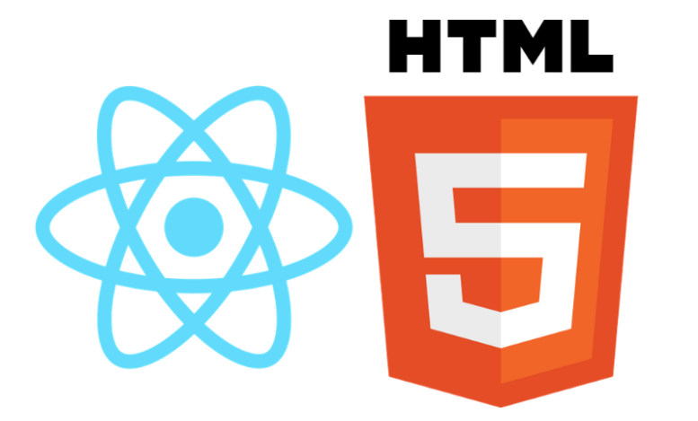

<br />
<p align="center">
  <a href="https://compassionate-panini-6e0d2c.netlify.app/">
    
  </a>

  <h3 align="center">Search for takeaway, restaurant, hotel and much more!!</h3>

  <p align="center">
    
    
    
  </p>

  <p align="center">
    <a href="https://compassionate-panini-6e0d2c.netlify.app/">View Demo</a>
    ·
    <a href="https://github.com/riteshprk/foodiehaus/issues">Report Bug</a>
    ·
    <a href="https://github.com/riteshprk/foodiehaus/issues">Request Feature</a>
  </p>
</p>

<p align="center">An app to provide a list of restuarant, take away, hotel and muchmore according your needs.</p>

## Tech Stack



## :rocket: Quick start

Start developing locally.

### Step 1: Clone the repo

Fork the repository. then clone the repo locally by doing -

```sh
git clone https://github.com/riteshprk/foodiehaus.git
```

### Step 2: Install Dependencies

cd into the directory

```sh
cd foodiehaus
```

In the root folder do npm install.

```sh
npm install
# also in client
cd client & npm install
```

### Step 3: Setup .env

To run the server you will also need to provide the `.env` variables

- create a new file .env in the root
- open [.env.EXAMPLE](./.env.EXAMPLE)
- copy the contents and paste it to the .env with valid keys

#### And you are good to go

```sh
npm run develop
```

## :open_file_folder: What's inside?

A quick look at the folder structure of this project.

    foodiehaus
    ├─node_modules
    ├─public
    └─src
    │ ├───components
    │ ├───medis
    │ ├───util
    │ ├───index.css
    │ ├───index.js
    │ ├───serviceWorker.js
    │ └───setupTest.js
    │
    │
    ├─── LICENSE
    ├─── package.json
    └─── README.md

## :v: Contributing

After cloning & setting up the local project you can push the changes to your github fork and make a pull request.

> You can also run the tests locally to see if everything works fine with

### Pushing the changes

```bash
git add .
git commit -m "feat: added new stuff"
git push YOUR_REPO_URL develop
```

---

Made with :heart: and React
